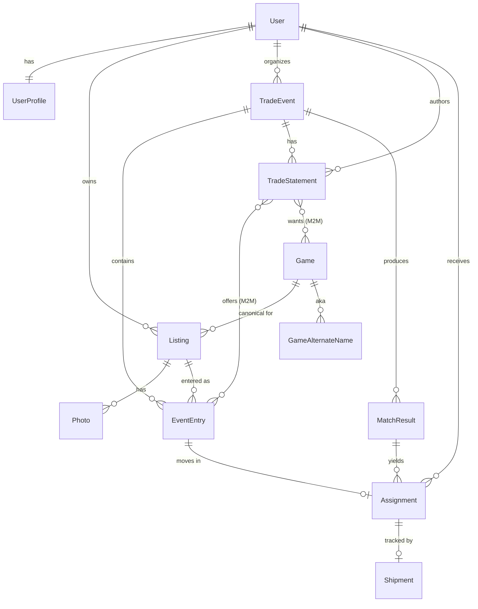

# Board Game Trading Platform — First Version Plan

*Greenfield. Nothing is implemented yet; this document defines the first working version and the order to build it.*

---

## 1. Context & goal

A web service for **math trades** of physical board games: people list copies they own and are willing to trade, an organizer runs an event, and an engine finds the largest consistent set of items that can change hands at once (usually multi-party, not just A↔B).

The optimization engine **already exists** and is treated as a black box behind a defined I/O contract. This platform owns everything around it — accounts, catalog, copies, events, trade statements, results, shipping — and exposes it over a REST API.

Two things define the first version's character:
- **Game-centric.** Browsing happens at the canonical BoardGameGeek (BGG) game level; every user's copies group under one game entry and are easy to compare. (Metadata syncs from BGG.)
- **M-to-N bundles, natively.** Beyond classic want lists, a single statement can say *"give at most M of these, get at least N of those."*

**Stack:** Django + Django REST Framework (DRF), **SQLite** to start (one setting switches to Postgres later), `requests` for BGG, Django auth. Auth uses DRF `SessionAuthentication` (which powers the browsable API — our interim UI) plus `TokenAuthentication` for API clients.

---

## 2. Scope of the first version

**In scope**
- Accounts: register / login; link & verify a BGG username; import a BGG collection.
- Catalog of canonical games synced from BGG, keyed by BGG ID.
- Users upload **copies** (listings); each copy has its own ID and structured metadata.
- Game-centric browse + copy-comparison read endpoints.
- Organizers create **Trade Events** and drive the full lifecycle.
- Users enter copies into an event and author **trade statements** (classic want lists *and* M-to-N bundles).
- Build the engine input, run the engine (or a stub), parse output into **assignments**, expose results.
- Shipping / completion tracking; archive.

**Deferred to later versions** (deliberately not built now)
- **Duplicate protection** — capping how many copies you *receive* (the "dummy" mechanism). The first-version format expresses *give ≤ M* and *get ≥ N* only; there is no upper bound on receipts yet.
- **Want-side priorities / ranking** — want sets are unordered for now.
- A dedicated SPA frontend; JWT; notifications; payments/geekgold; mobile apps.

---

## 3. Project layout

Django project `bgtrade/` with DRF, split into focused apps with a strict one-way dependency direction (`catalog` ← `inventory` ← `events` ← `wishlists` ← `matching` ← `shipping`).

```
bgtrade/
├── manage.py
├── bgtrade/        # settings (DRF config), urls, wsgi
├── accounts/       # UserProfile; BGG link/verify/import; auth endpoints
├── catalog/        # Game, GameAlternateName; BGG sync service; browse endpoints
├── inventory/      # Listing (copies), Photo
├── events/         # TradeEvent, EventEntry; lifecycle state machine; organizer actions
├── wishlists/      # TradeStatement (unified offer/want/M/N)
├── matching/       # engine adapter (build input / parse output); MatchResult, Assignment
└── shipping/       # Shipment / confirmation
```

DRF wiring: a `DefaultRouter` per app for CRUD `ModelViewSet`s; cross-cutting verbs (lifecycle transition, run-match, BGG import, mark-shipped) are DRF `@action`s; event-scoped resources nest under `/events/{slug}/`. Keep everything in the ORM and avoid SQLite-specific SQL so the Postgres switch is just a `DATABASES` change.

---

## 4. Core concepts

- **Canonical Game** — one row per BGG game (`bgg_id`). The unit of *browsing*. Synced from BGG.
- **Listing (a "copy")** — one physical copy a user owns, with its own `listing_id` independent of the BGG ID, plus condition / edition / language / etc. The unit of *ownership*. Many listings → one game.
- **Trade Event** — a time-boxed math trade with its own rules, run by an organizer.
- **Event Entry** — a listing entered into a specific event. Carries the **item token** used in the engine (`A`, `B`, … or a generated code). Many entries → one listing over time.
- **Trade Statement** — the single, unified want/bundle unit: an offer set, a want set, and bounds `(M-to-N)`. A classic want list is the degenerate `(1-to-1)`.
- **Match Result** — one engine run for an event; stores input, raw output, and parsed assignments.
- **Assignment** — one result fact: *item token → recipient user*. The item's owner ships it to that recipient.

---

## 5. Data model



Field sketches (Django-style; types abbreviated):

**accounts.UserProfile**
```
user            OneToOne(User)
bgg_username    Char (nullable, indexed)
bgg_verified    Bool (default False)
default_country Char
default_region  Char            # "EU", "US-48", "LATAM", ...
is_organizer    Bool (default False)
timezone        Char
```

**catalog.Game**  ← browse-primary entity
```
bgg_id          Integer (unique, indexed)   # canonical key
name            Char (indexed)
year_published  Integer (nullable)
thumbnail_url   URL
image_url       URL
min_players     Integer (nullable)
max_players     Integer (nullable)
playing_time    Integer (nullable)
weight          Float (nullable)            # BGG complexity, cached
avg_rating      Float (nullable)            # cached
description     Text (nullable)             # cached
last_synced_at  DateTime
```

**catalog.GameAlternateName** — `game FK`, `name (indexed)`.

**inventory.Listing**  ← the "copy", owns its own id
```
id / listing_id BigAuto / UUID (independent of bgg_id)
game            FK(Game)
owner           FK(User)
condition       Char(choices)   # NEW / LIKE_NEW / VERY_GOOD / GOOD / ACCEPTABLE / FOR_PARTS
language        Char
bgg_version_id  Integer (nullable)
edition_note    Char
completeness    Char(choices)   # COMPLETE / MISSING_MINOR / MISSING_MAJOR
notes           Text
estimated_value Decimal (nullable)
is_active       Bool (default True)
created_at      DateTime
```

**inventory.Photo** — `listing FK`, `image`, `caption`, `order`.

**events.TradeEvent**
```
name, slug (unique), description
organizer            FK(User)
status               Char(choices)        # lifecycle, Section 7
region_rule          Char
allow_bundles        Bool (default True)  # permit M>1 or N>1
submissions_close_at DateTime (nullable)
wantlist_close_at    DateTime (nullable)
max_listings_per_user Integer (nullable)
created_at           DateTime
```

**events.EventEntry**  ← join of a copy into an event; holds the engine token
```
event           FK(TradeEvent)
listing         FK(Listing)
item_token      Char (nullable until tokens published)   # "A", "B", ... or generated code
status          Char(choices)            # ENTERED / WITHDRAWN
unique_together (event, listing)
```

**wishlists.TradeStatement**  ← the single want/bundle unit
```
event         FK(TradeEvent)
owner         FK(User)
give_at_most  PositiveInt   # M — at most M of the offered copies leave
get_at_least  PositiveInt   # N — at least N of the wanted games arrive
created_at    DateTime

offer_entries M2M(EventEntry)        # LEFT side: this owner's specific copies
want_games    M2M(Game)              # RIGHT side: canonical games (game-centric)
want_filters  JSON (nullable)        # e.g. {"min_condition":"GOOD","language":"EN","region":"LATAM"}
```
Validation: every `offer_entry` belongs to `event` and is owned by `owner`; `1 <= give_at_most <= offer_entries.count()`; `get_at_least >= 1`. A classic want list = one `offer_entry`, `M=1`, `N=1`.

**matching.MatchResult**
```
event         FK(TradeEvent)
input_json    JSON          # canonical engine input (Section 8)
input_text    Text (nullable)   # human-readable DSL mirror
output_json   JSON          # raw engine output
status        Char          # PENDING / RUNNING / DONE / FAILED
items_traded  Integer (nullable)
users_trading Integer (nullable)
started_at, finished_at      DateTime
```

**matching.Assignment**
```
match_result  FK(MatchResult)
entry         FK(EventEntry)   # the item that moves
recipient     FK(User)         # who receives it
# sender is implicit: entry.listing.owner ships `entry` to `recipient`
```

**shipping.Shipment** — `assignment OneToOne`, `status (PENDING/SHIPPED/RECEIVED)`, `tracking`, `shipped_at`, `received_at`, `disputed Bool`, `notes`.

---

## 6. BoardGameGeek integration

Base URL `https://boardgamegeek.com/xmlapi2/`. A thin `catalog/bgg.py` service is the only thing that talks to BGG; everything else uses our models.

**Endpoints**
- `GET /search?query=<q>&type=boardgame` — name/AKA search → `(bgg_id, name, year)`.
- `GET /thing?id=<id>&type=boardgame&stats=1&versions=1` — full detail to populate/refresh a `Game`.
- `GET /collection?username=<u>&own=1` — owned collection for import.
- `GET /user?name=<u>` — BGG username link/verify.

**Operational rules (these matter)**
- **HTTP 202 = "queued, retry."** `/collection` returns 202 while BGG builds the response; retry with backoff (≈2s start, capped attempts) until 200.
- **Throttle** outbound requests (requests-per-minute cap); back off on 429.
- **Cache:** create/refresh a `Game` from `/thing` and reuse; re-sync only when `last_synced_at` exceeds a TTL (7–30 days) or on explicit refresh. Keeps browsing instant and BGG calls rare.
- **XML, not JSON.** Parse with `xml.etree.ElementTree`, defensively.

**Flows**
1. **Link BGG account** — store username, `bgg_verified=False`; verify via a lightweight challenge (token in profile, or confirm a known owned item). Verification is gated behind a setting.
2. **Import collection** — `/collection?own=1` → for each item `get_or_create` the `Game` (fetch `/thing` if missing/stale) → create **draft Listings** the user confirms/edits. Idempotent.
3. **Listing creation** — search BGG via our endpoint → pick result → ensure the `Game` exists → fill copy metadata → save `Listing`.

---

## 7. Trade Event lifecycle (state machine)

One `status` field plus a validated `transition_to()` that runs side effects. Forward transitions are organizer-triggered via `POST /api/events/{slug}/transition/ {to: ...}`; limited rollback is allowed before matching.

| # | State | Users can | Organizer can | Locked |
|---|---|---|---|---|
| 0 | **Draft** *(optional setup)* | — | edit all rules | event hidden |
| 1 | **Open for submissions** | enter/withdraw copies | edit rules; → wantlist | results |
| 2 | **Open for want list** | author/edit statements; **submissions frozen** | publish item tokens; → matching | offers set |
| 3 | **Matching computation** | view only | **run-match**, re-run | everything (read-only) |
| 4 | **Match review** | view own assignments; flag/dispute | review, re-run, or accept | edits |
| 5 | **Finalization** | confirm participation | lock results | results frozen |
| 6 | **Shipping / completion** | mark shipped/received | monitor; resolve disputes | results |
| 7 | **Archive** | view history only | nothing | all |

**Side effects on transition**
- **1 → 2:** freeze the `EventEntry` set; **assign `item_token`s** (stable, citable thereafter).
- **2 → 3:** freeze statements; build engine input (Section 8); create a `MatchResult`.
- **3 → 4:** parse output → `Assignment` rows; compute per-user obligations.
- **5 → 6:** create `Shipment` rows for every assignment.
- **6 → 7:** snapshot; mark read-only.

---

## 8. Trade statements & the matching contract

### 8.1 The statement (wishlist + bundles, unified)

Users wish at the **game level**; the platform compiles to **token-level** statements for the engine.

- Default: each offered copy is its own `(1-to-1)` statement (a classic want list).
- Bundle: select several offered copies + several wanted games and set the bounds.

The format, one statement per line:
```
A B C D -> E F G  (3-to-2)     # give at most 3 of {A,B,C,D}; get at least 2 of {E,F,G}
A -> E F G                      # = (1-to-1): classic want list (give A, get any one of E/F/G)
```
`M` = `give_at_most`, `N` = `get_at_least`. The `(M-to-N)` suffix is optional and defaults to `(1-to-1)`. Want sets are unordered (no priorities in v1).

**Compilation:** for each `TradeStatement`, `offer` tokens = tokens of `offer_entries`; `want` tokens = tokens of every `EventEntry` whose `game ∈ want_games`, passing `want_filters`, not owned by the author; carry `give_at_most` and `get_at_least`.

### 8.2 Engine input (JSON canonical; DSL mirror)

```json
{
  "event": "spring-2026",
  "items": [
    {"token": "A", "owner": "alice", "bgg_id": 13,     "name": "Catan"},
    {"token": "B", "owner": "alice", "bgg_id": 822,    "name": "Carcassonne"},
    {"token": "E", "owner": "bob",   "bgg_id": 266192, "name": "Wingspan"},
    {"token": "F", "owner": "carol", "bgg_id": 266192, "name": "Wingspan"}
  ],
  "statements": [
    {"owner": "alice", "offer": ["A","B","C","D"], "want": ["E","F","G"],
     "give_at_most": 3, "get_at_least": 2},
    {"owner": "bob",   "offer": ["E"], "want": ["A"], "give_at_most": 1, "get_at_least": 1}
  ]
}
```
Line-DSL mirror (also accepted/emitted, for humans):
```
# event: spring-2026  | items: A=alice/Catan B=alice/Carcassonne E=bob/Wingspan F=carol/Wingspan
A B C D -> E F G (3-to-2)
E -> A
```

### 8.3 Engine output (assignments)

```json
{
  "event": "spring-2026",
  "assignments": [
    {"token": "A", "to": "bob"},
    {"token": "E", "to": "alice"}
  ],
  "summary": {"items_traded": 2, "users_trading": 2}
}
```
Text mirror:
```
A -> bob
E -> alice
```
Each entry = "this item goes to this user." The item's current owner is known and the recipient is given, so **all shipping obligations follow directly** — no cycle/loop parsing. The parser maps each to an `Assignment(entry, recipient)`.

### 8.4 Adapter + stub

`matching/adapter.py`: `build_input(event) -> (json, text)` and `parse_output(json) -> [assignments]`. A `FakeMatcher` reads valid input and emits valid output (e.g. greedily satisfy mutual single-item wants) so the whole pipeline — author → build → run → parse → assignments → shipping — works before the real engine is wired in. Swapping in the real engine is one line in the `run-match` action.

### 8.5 Reproducibility

`MatchResult` stores `input_json`, `input_text`, and `output_json`, so any run can be reproduced and verified from stored data.

---

## 9. REST API map (DRF)

Routers register the CRUD viewsets; `@action`s cover the verbs. The browsable API doubles as the first-version frontend.

```
Auth & profile
  POST   /api/auth/register/
  POST   /api/auth/login/                -> token (session also set)
  POST   /api/auth/logout/
  GET    /api/me/                         -> profile
  POST   /api/me/bgg/link/                {bgg_username}
  POST   /api/me/bgg/verify/
  POST   /api/me/bgg/import/              -> start collection import

Catalog (read-mostly)
  GET    /api/games/                      ?q= ?available=
  GET    /api/games/{bgg_id}/
  GET    /api/games/{bgg_id}/listings/    -> copy-comparison payload

Inventory
  GET POST            /api/listings/
  GET PUT DELETE      /api/listings/{id}/
  POST                /api/listings/{id}/photos/

Events
  GET POST            /api/events/
  GET PUT             /api/events/{slug}/
  POST                /api/events/{slug}/transition/   {to}        (organizer)
  POST                /api/events/{slug}/run-match/                (organizer; state MATCHING)

Event entries (enter copies)
  GET POST            /api/events/{slug}/entries/        (POST = enter a listing)
  DELETE              /api/events/{slug}/entries/{id}/   (withdraw)

Trade statements (wishlist / bundles)
  GET POST            /api/events/{slug}/statements/
  GET PUT DELETE      /api/events/{slug}/statements/{id}/

Results & shipping
  GET    /api/events/{slug}/result/        -> latest MatchResult + my assignments
  GET    /api/events/{slug}/shipping/      -> my ship/receive obligations
  POST   /api/shipments/{id}/mark-shipped/
  POST   /api/shipments/{id}/mark-received/
```

---

## 10. Permissions & roles (DRF)

- **Catalog browse:** `IsAuthenticatedOrReadOnly`.
- **Listings & statements:** `IsOwnerOrReadOnly` (object-level `obj.owner == request.user`).
- **Event create + transition + run-match:** `IsOrganizer` (create requires `profile.is_organizer`; object-level requires `event.organizer == request.user`).
- **Staff/superuser:** Django admin for catalog cleanup, BGG re-sync, and emergency fixes — register every model in `admin.py` for free organizer tooling.

---

## 11. Build order

Each milestone is independently demoable against the browsable API. Milestones 1–7 are the first working version; 8–9 add completion and the real engine.

1. **Skeleton + DRF + auth.** Project, apps, SQLite, DRF settings (session + token), register/login, browsable API on, Django admin on.
2. **Catalog + BGG.** `Game`, `bgg.py` (search + `/thing` with 202 retry + caching), game list/detail viewsets + serializers.
3. **Inventory.** `Listing` + `Photo`, listings viewset, `games/{bgg_id}/listings/` comparison endpoint. *Browsing works end to end.*
4. **BGG import.** Collection import → draft listings (`@action`).
5. **Events core.** `TradeEvent`, `EventEntry`, lifecycle state machine (states 1–2 first), `transition` action, entries endpoints, token assignment on close.
6. **Trade statements.** Unified `TradeStatement` (offer entries, want games + filters, M/N), serializer validation, event-scoped endpoints.
7. **Matching pipeline.** `adapter.build_input` (JSON + DSL), `FakeMatcher`, `adapter.parse_output`, `MatchResult`, `Assignment`, `run-match` action, `result` endpoint. *A full math trade — including bundles — runs.*
8. **Shipping.** States 5–7, `Shipment`, mark-shipped/received, archive.
9. **Wire the real engine.** Replace `FakeMatcher` with the real engine call; verify reproducibility via stored JSON.

---

## Appendix A — Enums (copy/paste)

```python
class Condition(models.TextChoices):
    NEW        = "NEW", "New / sealed"
    LIKE_NEW   = "LIKE_NEW", "Like new"
    VERY_GOOD  = "VERY_GOOD", "Very good"
    GOOD       = "GOOD", "Good"
    ACCEPTABLE = "ACCEPTABLE", "Acceptable"
    FOR_PARTS  = "FOR_PARTS", "For parts / incomplete"

class EventStatus(models.TextChoices):
    DRAFT            = "DRAFT", "Draft"
    OPEN_SUBMISSIONS = "OPEN_SUBMISSIONS", "Open for submissions"
    OPEN_WANTLIST    = "OPEN_WANTLIST", "Open for want list"
    MATCHING         = "MATCHING", "Matching computation"
    MATCH_REVIEW     = "MATCH_REVIEW", "Match review"
    FINALIZED        = "FINALIZED", "Finalization"
    SHIPPING         = "SHIPPING", "Shipping / completion"
    ARCHIVED         = "ARCHIVED", "Archive"
```

## Appendix B — BGG calls cheat-sheet

```
SEARCH   GET /xmlapi2/search?query=catan&type=boardgame
DETAIL   GET /xmlapi2/thing?id=13&type=boardgame&stats=1&versions=1
COLLECT  GET /xmlapi2/collection?username=<u>&own=1     # may return 202 -> retry w/ backoff
USER     GET /xmlapi2/user?name=<u>                     # link / verify
BASE     https://boardgamegeek.com/xmlapi2/   (XML; parse with ElementTree)
```

## Appendix C — Worked matching example

Tokens: `A`=alice/Catan, `B`=alice/Carcassonne, `E`=bob/Wingspan, `F`=carol/Wingspan.
Statements:
```
A B -> E F (1-to-1)     # alice: give at most 1 of {Catan, Carcassonne}, get at least 1 Wingspan copy
E -> A                  # bob wants alice's Catan for his Wingspan
```
A possible engine output:
```
A -> bob
E -> alice
```
Reconstruction: alice ships **A (Catan)** to bob; bob ships **E (Wingspan)** to alice. Alice gave 1 of {A,B} (≤1 ✓) and got 1 Wingspan (≥1 ✓); B stays with alice; carol's F didn't trade.
